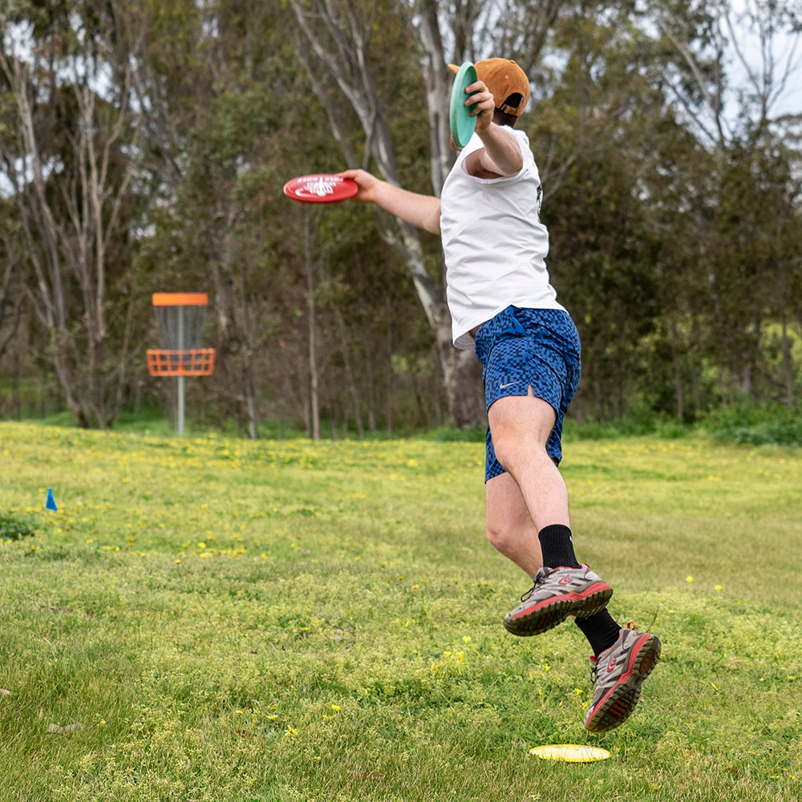

# Bald Hill Park Disc Golf Course

## Location
**Inverness St, Clarinda** (just south of Melbourne city)

## Course Images

## Course Features
- **9 baskets**
- **18 tees**
- **Concrete tee pads**
- **RAD baskets**
- **Full course signage**
- **Practice basket area** with "how to play" sign for new players

## Course Design
- Designed to be beginner-friendly
- Provides complete disc golf experience for players of all skill levels
- Practice area specifically designed to help new players learn

## Source
- **Original page**: https://www.melbournediscgolf.com/bald-hill-park-disc-golf-course/
