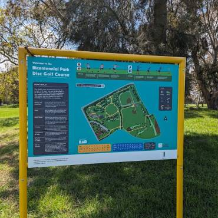
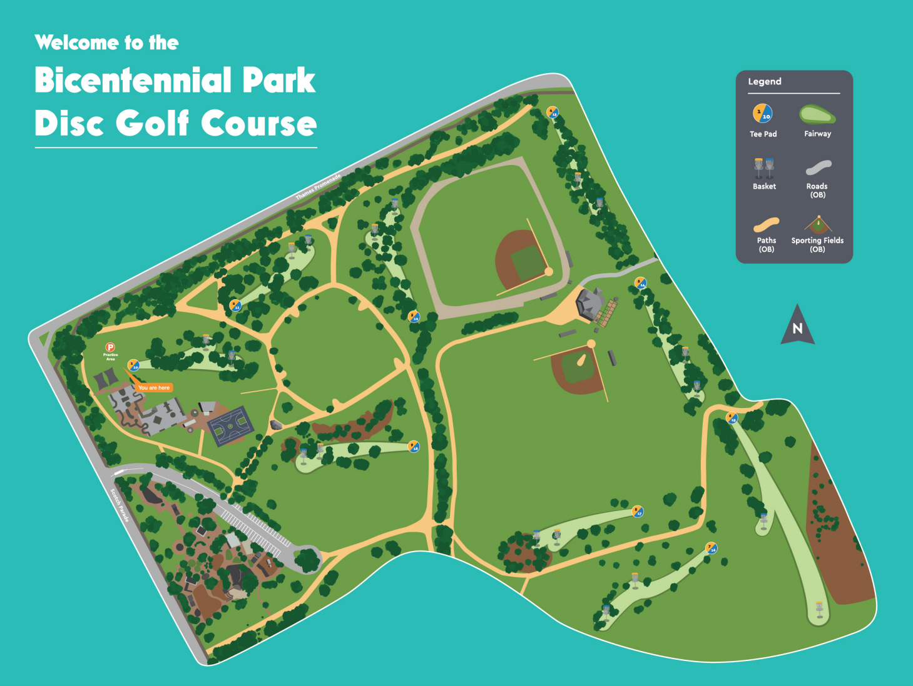

# Bicentennial Park Disc Golf Course

## Location
**City of Kingston, Melbourne**

## Course Images

## Course Features
- **9 tees**
- **18 baskets**
- **Practice basket**
- **Tee signage**
- **Main sign** with course map and "How-to" guide

## Course Layout
- **First half**: Winds through trees
- **Second half**: More open holes
- **Difficulty**: Suitable for both new and experienced players
- **Challenge Level**: "A fantastic challenge"

## Park Amenities
- Toilets
- Playground
- Skatepark
- Netball/basketball courts
- Football ovals
- Baseball diamonds

## Source
- **Original page**: https://www.melbournediscgolf.com/bicentennial-park/
