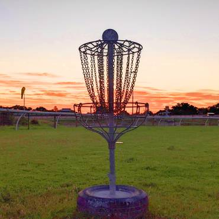
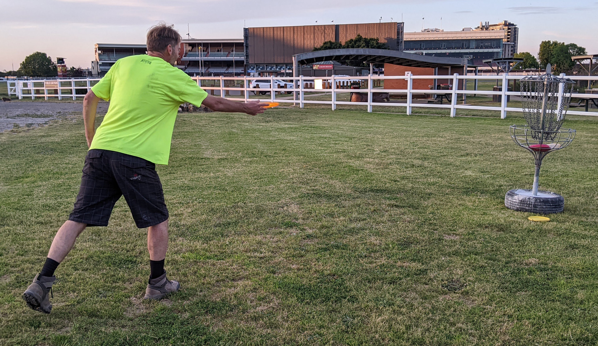
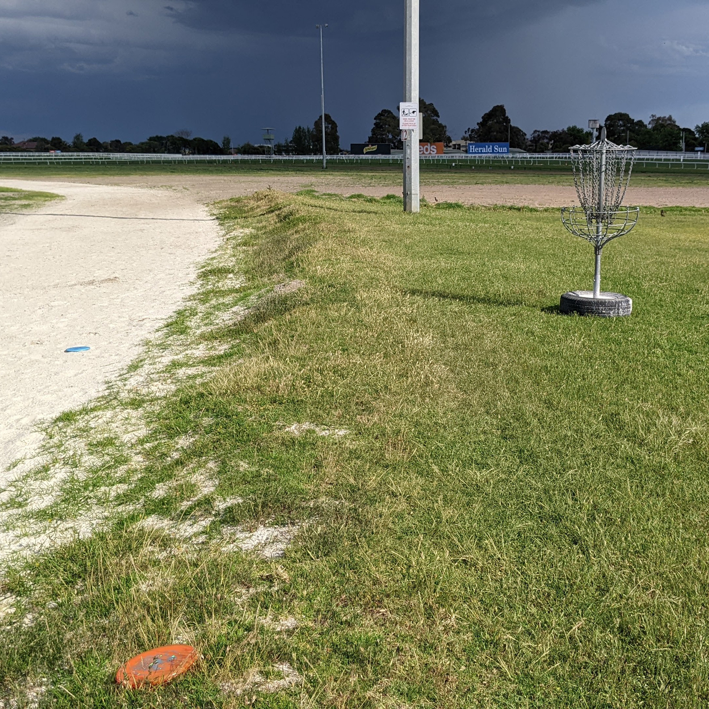
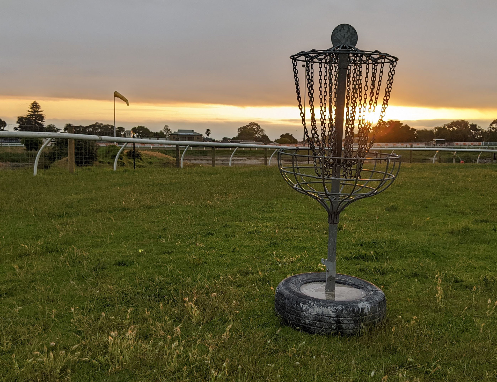
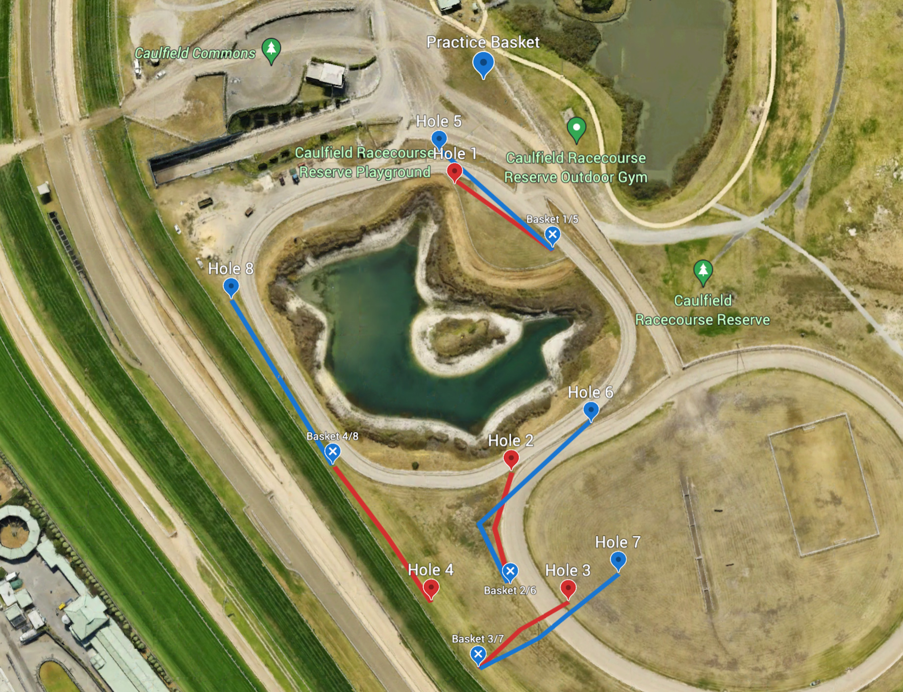

# Caulfield Racecourse Disc Golf Course

## Location
**Caulfield Racecourse, Melbourne**

## Course Images

## Course Features
- **4-basket temporary course**
- **Beginner-friendly layout**
- **Often windy conditions**
- **Suitable for**: Beginners, families, and intermediate players

## Facilities
- **Free BBQ facilities**
- **Toilet facilities**
- **Central amenities building**

## Access
- **Hours**: Daily from early morning until sunset
- **Cost**: Free

## Course Character
"Perfect for beginners and families, but also intermediate players wishing to test themselves on a tricky layout"

## Source
- **Original page**: https://www.melbournediscgolf.com/caulfield-racecourse/
