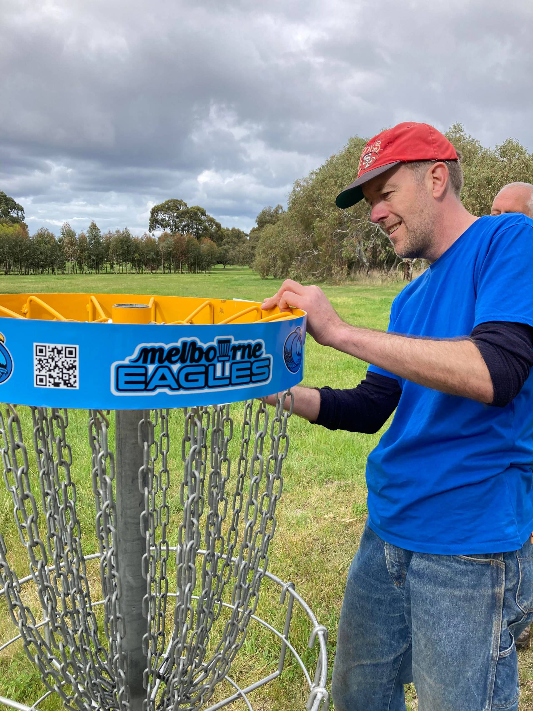
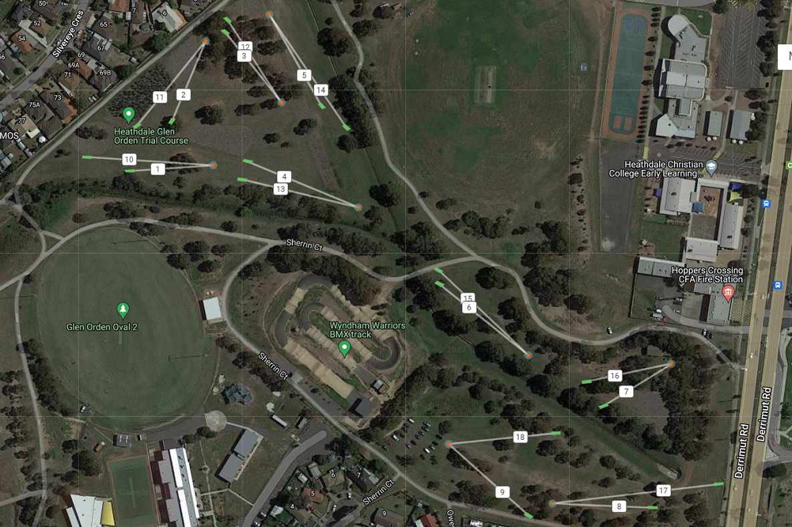

# Heathdale Glen Orden Disc Golf Course

## Location
**Heathdale Glen Orden Reserve, Werribee**

## Course Images

## Course Features
- **9-basket course**
- **Two main sections**: North and south sides
- **Navigation**: Players transition from hole 5 to hole 6 using path in northeast section

## Development
**Collaboration**: Partnership between Melbourne Disc Golf Club and Wyndham City

## Purpose
Provides disc golf playing experience in the Werribee area with structured layout across the reserve.

## Source
- **Original page**: https://www.melbournediscgolf.com/heathdale-glen-orden-trial/
