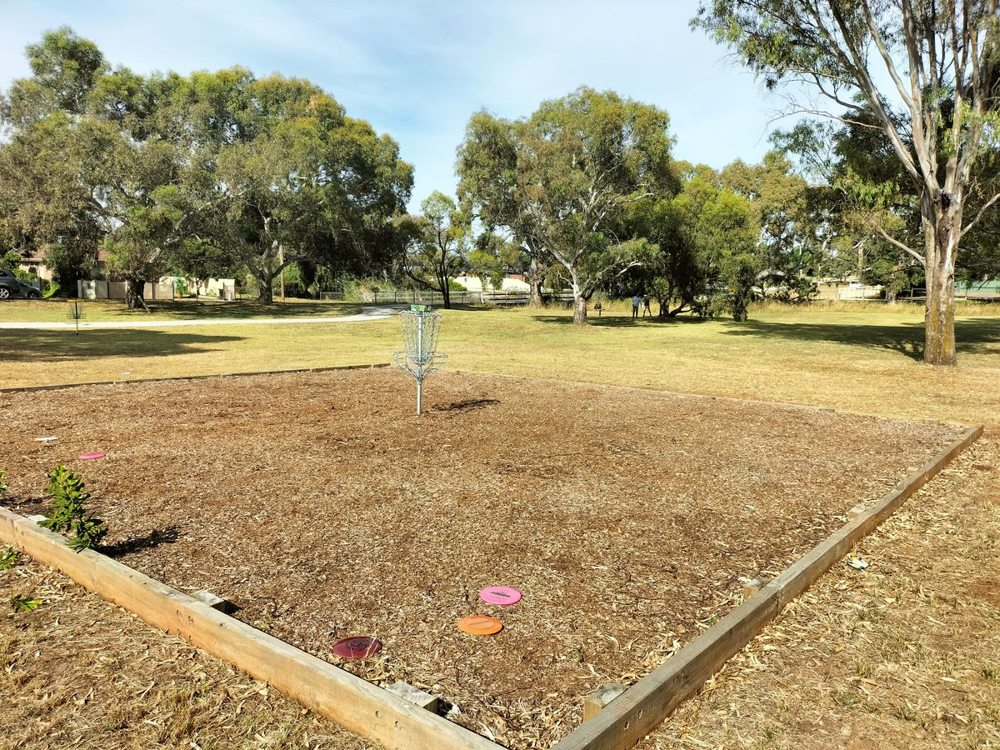

# Little Blind Creek Disc Golf Course

## Location
**Little Blind Creek Reserve, Melton City**

## Course Image

## Course Features
- **9-hole layout**
- **9 baskets**
- **Tee pads and signage**
- **Clockwise direction**
- **Short and technical holes** with multiple throwing lines

## Course Character
- **Beginner-friendly design**
- **Signature hole**: First hole runs alongside high-traffic road
- **Natural features**: Gumtrees create challenging shot opportunities
- **Terrain**: Showcases natural reserve environment

## Development
**Collaboration**: Melbourne Disc Golf Club and Melton City Council

## Target Audience
Accessible for players of different skill levels, designed to provide engaging experience for both new and experienced players.

## Source
- **Original page**: https://www.melbournediscgolf.com/little-blind-creek/

## Navigation
- [Back to Melbourne Courses](../melbourne-courses/index.md)