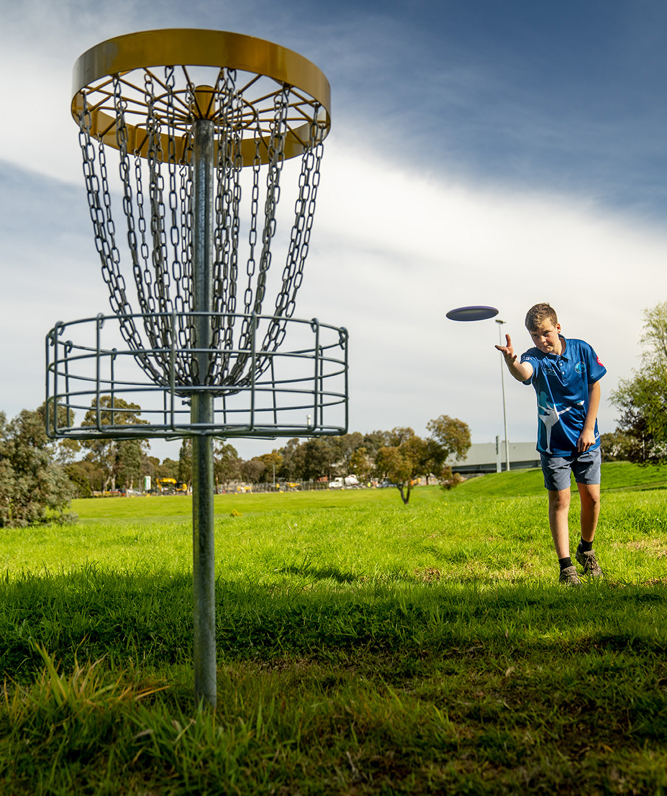
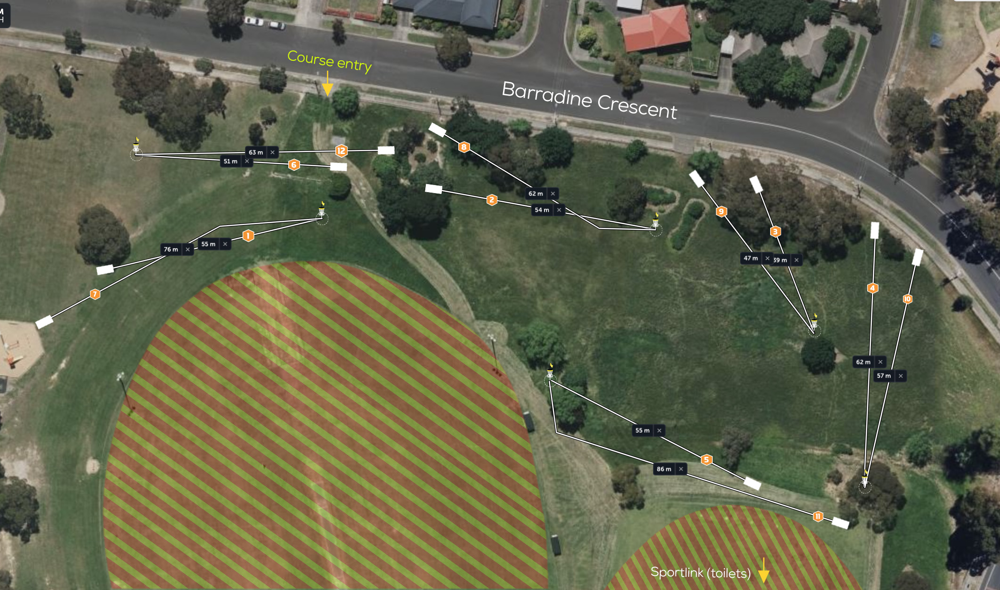

# Livingstone Primary School Disc Golf Course

## Location
**Livingstone Primary School grounds**

## Course Images

## Course Features
- **6 baskets**
- **Short holes**
- **Tight hyzer/anhyzer lines**

## Ideal For
- **Ace runs**
- **Practicing short game**
- **Introducing new players to disc golf**

## Course Management
- Check-in sign installed near 2nd hole
- Usage tracking recommended
- **Support**: Whitehorse City Council

## Source
- **Original page**: https://www.melbournediscgolf.com/livingstone-primary-school/
