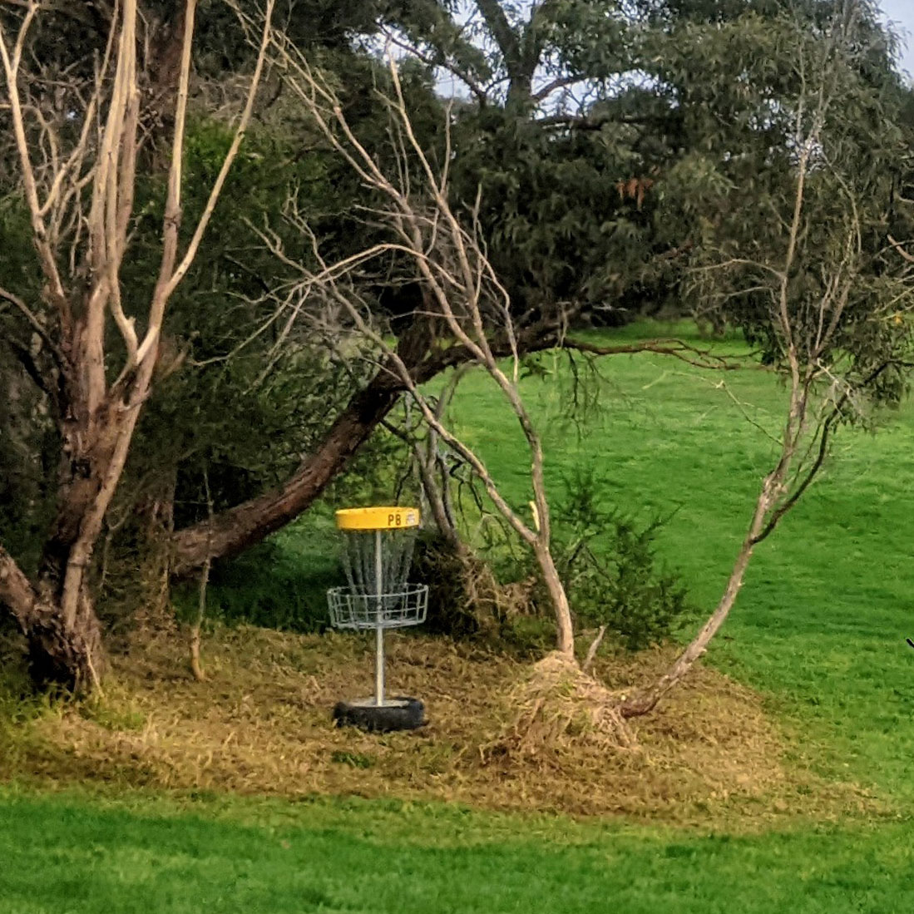
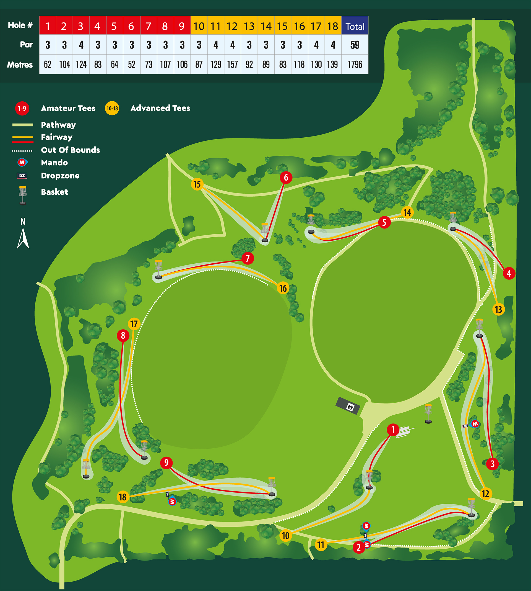

# Llewellyn Park Disc Golf Course

## Location
**Wantirna South, Melbourne**

## Course Images

## Course Features
- **9 baskets, 18 tees**
- **Temporary course**
- **Suitable for**: Beginners to intermediate players
- **Heritage**: Maintains some holes from "Melbourne Celebrates 2023" event

## Facilities
- **Central pavilion**
- **Free BBQ facilities**
- **Toilets**
- **Planned**: Course sign and check-in area near cricket practice nets

## Purpose
Designed to be a welcoming location for introducing friends and family to disc golf.

## Source
- **Original page**: https://www.melbournediscgolf.com/llewellyn-park/
