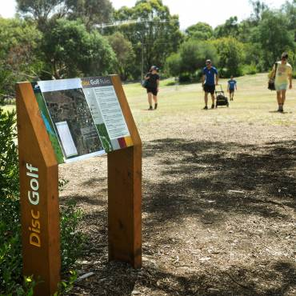
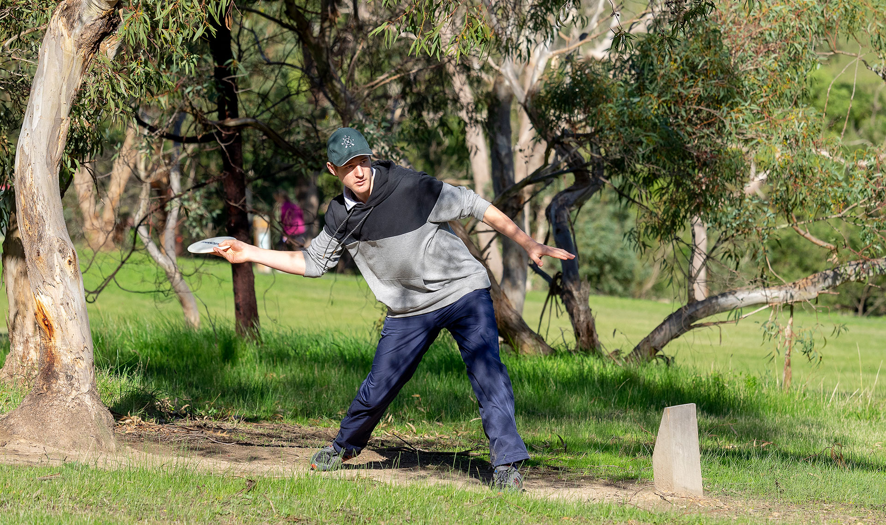
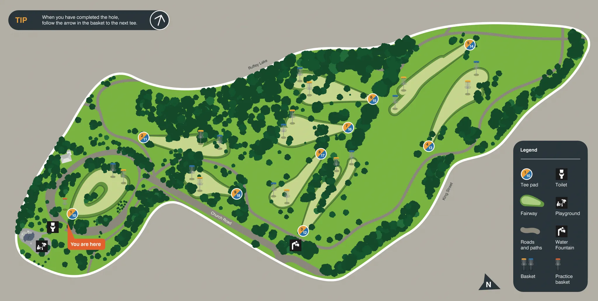

# Ruffey Lake Park Disc Golf Course

## Location
**Manningham City Council area, Melbourne**

## Course Images

## Course Information
- **Cost**: Free to play
- **Type**: Public park course
- **Status**: Home turf for Melbourne Disc Golf Club (MDGC)

## Course History
- **Original Installation**: 2012
  - 6 baskets
  - Tee signs
- **Expansion**: Early 2016
  - Added 3 new baskets
  - MDGC added additional tees

## Park Description
"An amazingly large area of public parkland" suitable for disc golf.

## Source
- **Original page**: https://www.melbournediscgolf.com/ruffey-lake-park-disc-golf-course/
