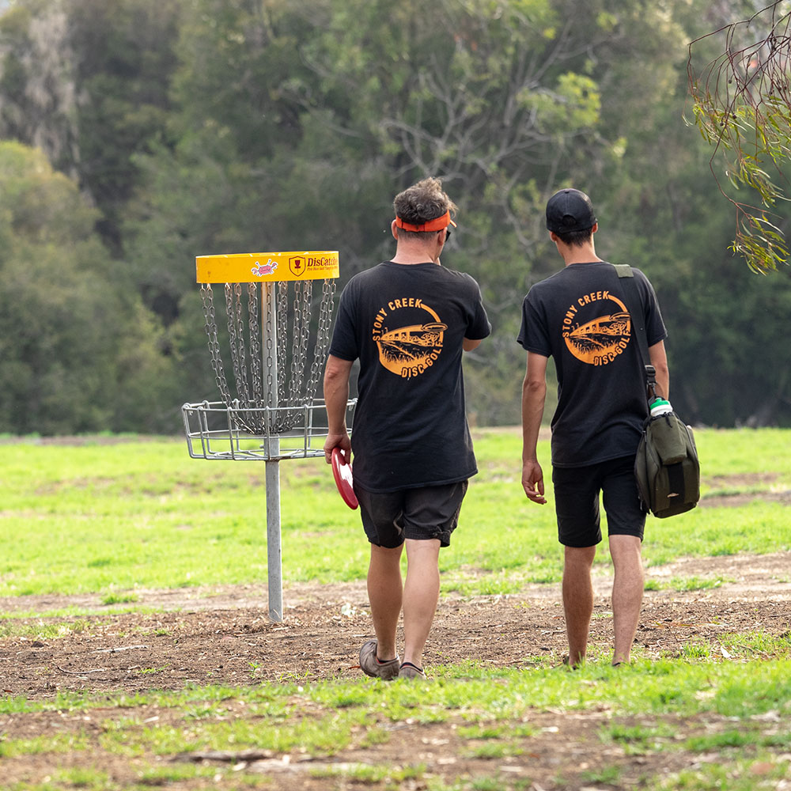
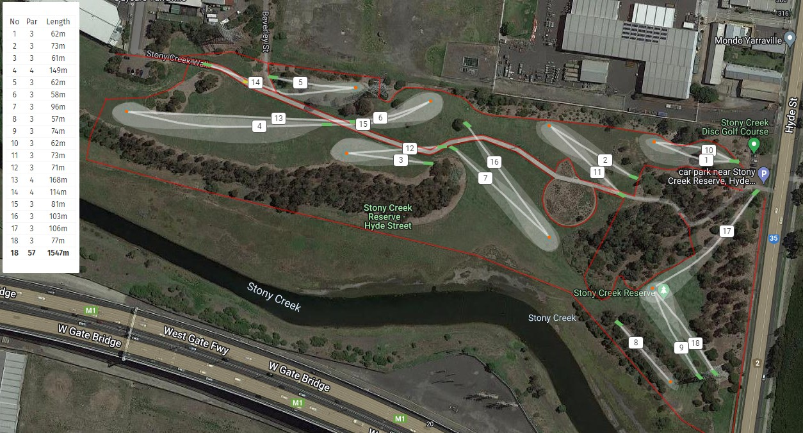

# Stony Creek Disc Golf Course

## Location
**Stony Creek Reserve** - Near Melbourne CBD, located under the Westgate Bridge

## Course Images

## Course Features
- **9 concrete teepads**
- **9 permanent baskets**
- **Cost**: Free to play
- **Course map**: Coming soon
- **Details**: Available on uDisc app

## Course History
- **Original Installation**: 2017
  - 3 permanent baskets
  - 1 homemade basket
- **Major Upgrade**: Expanded to current 9-basket layout with concrete teepads

## Development
Collaborative effort between the local disc golf community and Maribyrnong City Council to develop a public disc golf facility.

## Source
- **Original page**: https://www.melbournediscgolf.com/stony-creek-disc-golf-course/
