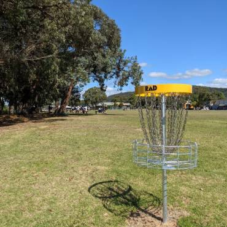
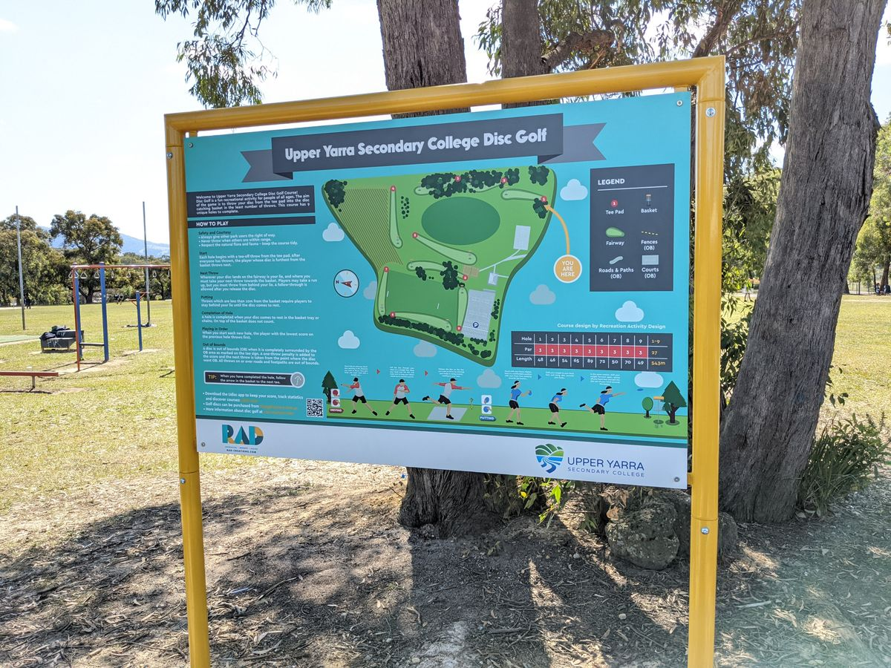
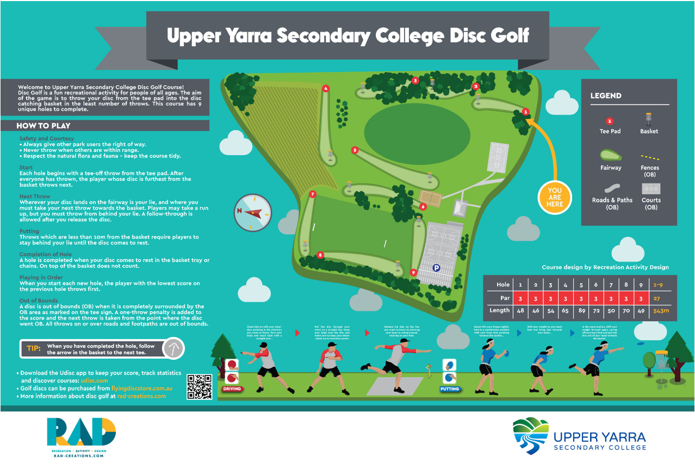

# Upper Yarra Secondary College Disc Golf Course

## Location
**Yarra Junction, Yarra Ranges**

## Course Images

## Course Features
- **9-hole disc golf course**
- **Integrated into physical education curriculum**
- **Available during free time for students**
- **Used by both students and staff during breaks**

## Development
- **Designer/Installer**: Andrew Ferguson from RAD
- **Collaboration**: Principal Scott Tully

## Educational Integration
Provides innovative recreational and educational opportunities for the school community, allowing engagement with disc golf during the school day.

## Source
- **Original page**: https://www.melbournediscgolf.com/upper-yarra-secondary-college/
